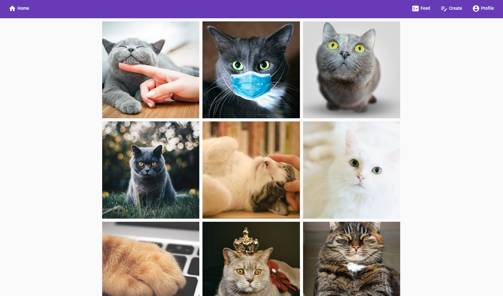

# Kotkogram

Kotkogram is like Instagram... but for cats!

Angular SoftUni Exam Project.

## Tech Stack

- Angular 14
- Angular Material
- TailwindCSS

## Backend

The app has its own dedicated REST API.

- URL: *SoonTM*
- GitHub: <https://github.com/mariovyord/kotkogram-api>

## Development server

Run `ng serve` for a dev server. Navigate to `http://localhost:4200/`.

## Build

Run `ng build` to build the project. The build artifacts will be stored in the `dist/` directory.

## Running unit tests

Run `ng test` to execute the unit tests via [Karma](https://karma-runner.github.io).

## Running end-to-end tests

Run `ng e2e` to execute the end-to-end tests via a platform of your choice. To use this command, you need to first add a package that implements end-to-end testing capabilities.

## Screenshots

